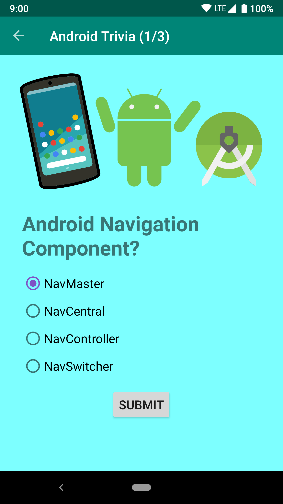

# Navigation

Este foi o projeto realizado na aula 3 do Curso [Android App Development in Kotlin course on Udacity](https://www.udacity.com/course/developing-android-apps-with-kotlin--ud9012), ministrado pela Google.

## Android Trivia 

O Android Trivia é um aplicativo que faz perguntas ao usuário sobre desenvolvimento Android. Foi feito com o Navigation Component com Jetpack para mover o usuário entre diferentes telas. Cada tela esta implementada como um Fragment. A aplicação faz a navegação através de botões, a Action Bar, e o Navigation Drawer.

## Screenshots

 

